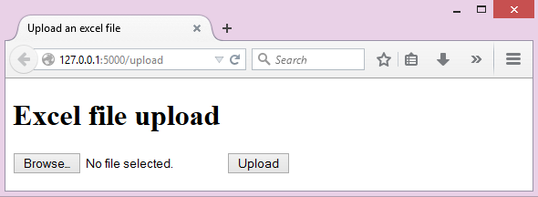
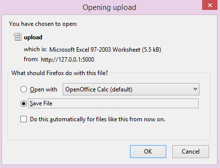

.. pyramid-excel documentation master file, created by
   sphinx-quickstart on Wed Jan 07 08:46:32 2015.
   You can adapt this file completely to your liking, but it should at least
   contain the root `toctree` directive.

Welcome to pyramid-excel's documentation!
================================================================================

:Author: C.W.
:Issues: http://github.com/pyexcel/pyramid-excel/issues
:License: New BSD License
:Development: |version|
:Released: |release|
:Generated: |today|

Here is a typical conversation between the developer and the user::

 User: "I have uploaded an excel file"
       "but your application says un-supported file format"
 Developer: "Did you upload an xlsx file or a csv file?"
 User: "Well, I am not sure. I saved the data using "
       "Microsoft Excel. Surely, it must be in an excel format."
 Developer: "OK. Here is the thing. I were not told to support"
            "all available excel formats in day 1. Live with it"
            "or delay the project x number of days."

**pyramid-excel** is based on `pyexcel <https://github.com/pyexcel/pyexcel>`_ and makes
it easy to consume/produce information stored in excel files over HTTP protocol as
well as on file system. This library can turn the excel data into a list of lists,
a list of records(dictionaries), dictionaries of lists. And vice versa. Hence it
lets you focus on data in Pyramid based web development, instead of file formats.

The idea originated from the common usability problem when developing an excel file
driven web applications for non-technical office workers: such as office assistant,
human resource administrator. The fact is that not all people know the
difference among various excel formats: csv, xls, xlsx. Instead of training those people
about file formats, this library helps web developers to handle most of the excel file
formats by providing a common programming interface. To add a specific excel file format
to you application, all you need is to install an extra pyexcel plugin. No code change
to your application.

The highlighted features are:

#. excel data import into and export from databases
#. turn uploaded excel file directly into Python data structure
#. pass Python data structures as an excel file download
#. provide data persistence as an excel file in server side
#. supports csv, tsv, csvz, tsvz by default and other formats are supported via
   the following plugins:

.. _file-format-list:

.. table:: A list of file formats supported by external plugins

   ================ ========================================
   Plugins          Supported file formats
   ================ ========================================
   `pyexcel-xls`_   xls, xlsx(r), xlsm(r)
   `pyexcel-xlsx`_  xlsx
   `pyexcel-ods3`_  ods (python 2.6, 2.7, 3.3, 3.4)
   `pyexcel-ods`_   ods (python 2.6, 2.7)
   `pyexcel-text`_  (write only)json, rst, mediawiki, html
                    latex, grid, pipe, orgtbl, plain simple
   ================ ========================================

.. _pyexcel-xls: https://github.com/pyexcel/pyexcel-xls
.. _pyexcel-xlsx: https://github.com/pyexcel/pyexcel-xlsx
.. _pyexcel-ods: https://github.com/pyexcel/pyexcel-ods
.. _pyexcel-ods3: https://github.com/pyexcel/pyexcel-ods3
.. _pyexcel-text: https://github.com/pyexcel/pyexcel-text

This library makes information processing involving various excel files as easy as
processing array, dictionary when processing file upload/download, data import into
and export from SQL databases, information analysis and persistence. It uses
**pyexcel** and its plugins:

#. to provide one uniform programming interface to handle csv, tsv, xls, xlsx, xlsm and ods formats.
#. to provide one-stop utility to import the data in uploaded file into a database and to export tables in a database as excel files for file download.
#. to provide the same interface for information persistence at server side: saving a uploaded excel file to and loading a saved excel file from file system.

Installation
-------------------

Recently, pyexcel(0.2.2+) and its plugins(0.2.0+) started using newer version of setuptools. Please upgrade your setup tools before install latest pyexcel components:

.. code-block:: bash

    $ pip install --upgrade setuptools

You can install it via pip:

.. code-block:: bash

    $ pip install pyramid-excel

or clone it and install it:

.. code-block:: bash

    $ git clone http://github.com/pyexcel/pyramid-excel.git
    $ cd pyramid-excel
    $ python setup.py install

Installation of individual plugins , please refer to individual plugin page. For example, if you need xls file support, please install pyexcel-xls::

        $ pip install pyexcel-xls

Setup
------------------------

Once the pyramid_excel is installed, you must use the config.include mechanism to include it into your Pyramid project's configuration::

    config = Configurator(.....)
    config.include('pyramid_excel')

Alternately, you may activate the extension by changing your application's .ini file by
adding it to the pyramid.includes list::

    pyramid.includes = pyramid_excel

Quick Start
==============

Here is the quick demonstration code for pyramid-excel::

    from wsgiref.simple_server import make_server
    from pyramid.config import Configurator
    from pyramid.response import Response
    from pyramid.view import view_config
    import pyramid_excel as excel
    
    
    upload_form = """
    <!doctype html>
    <title>Upload an excel file</title>
    <h1>Excel file upload</h1>
    <form action="" method=post enctype=multipart/form-data>

    <input type=file name=file><input type=submit value=Upload>
    </form>
    """
    
    
    @view_config(route_name='upload')
    def upload_view(request):
        if request.method == 'POST':
            data = request.get_array(field_name='file')
            return excel.make_response_from_array(data, 'xls', file_name="response")
        return Response(upload_form)
    
    
    if __name__ == '__main__':
        config = Configurator()
        config.include('pyramid_excel')
        config.add_route('upload', '/upload')
        config.scan()
        app = config.make_wsgi_app()
        server = make_server('0.0.0.0', 5000, app)
        print("Listening on 0.0.0.0:5000")
        server.serve_forever()

Before you start the server, let's install a plugin to support xls file format::

    $ pip install pyexcel-xls

And you can start the tiny server by this command, assuming you have save it as tiny_server.py::

    $ python tiny_server.py
    Listening on 0.0.0.0:5000

.. note::
    Alternatively, you can check out the code from `github <https://github.com/pyexcel/pyramid-excel>`_ ::
    
        git clone https://github.com/pyexcel/pyramid-excel.git

    The test application for pyramid-excel is a fully fledged site according to the tutorial here.
    
    Once you have the code, please change to pyramid-excel directory and then install all dependencies::
    
        $ cd pyramid-excel
        $ pip install -r requirements.txt
        $ pip install -r test_requirements.txt
    
    Then run the test application::
    
        $ pserve development.ini
        Starting server in PID 9852.
        serving on http://127.0.0.1:5000

More excel file formats
------------------------

The example application understands csv, tsv and its zipped variants: csvz and tsvz. If you would like to expand the list of supported excel file formats (see :ref:`file-format-list`) for your own application, you could install one or all of the following::

    pip install pyexcel-xls
    pip install pyexcel-xlsx
    pip install pyexcel-ods

.. warning::

   If you are using pyexcel <=0.2.1, you still need to import each plugin manually, e.g. `import pyexcel.ext.xls` and
   Your IDE or pyflakes may highlight it as un-used but it is used. The registration of
   the extra file format support happens when the import action is performed

Handle excel file upload and download
++++++++++++++++++++++++++++++++++++++

This example shows how to process uploaded excel file and how to make data download as an excel file.
Open your browser and visit http://localhost:5000/upload, you shall see this upload form:

please upload an xls file and you would get this dialog:

Please focus on the following code section::

    @view_config(route_name='upload')
    def upload_view(request):
        if request.method == 'POST':
            data = request.get_array(field_name='file')
            return excel.make_response_from_array(data, 'xls')
        return Response(upload_form)

By default, the GET request will be served with upload_form. Once an excel file is uploaded,
this library kicks in and help you get the data as an array. Then you can make an excel
file as download by using make_response_from_array.

Data import and export
-----------------------------

Continue with the previous example, the data import and export will be explained. You can copy
the following code in their own appearing sequence and paste them after the place holder::

    # insert database related code here

Alernatively, you can find the complete example on `github <https://github.com/pyexcel/pyramid-excel/blob/master/examples/database_example.py>`_

Now let's add the following imports first::

    from sqlalchemy import (
        Column,
        Index,
        Integer,
        Text,
        String,
        ForeignKey,
        DateTime,
        create_engine
        )
    
    from sqlalchemy.ext.declarative import declarative_base
    from sqlalchemy.orm import relationship, backref
    from sqlalchemy.orm import (
        scoped_session,
        sessionmaker,
        )
    
    from zope.sqlalchemy import ZopeTransactionExtension
    
    DBSession = scoped_session(sessionmaker(extension=ZopeTransactionExtension()))
    Base = declarative_base()

And paste some models::

    class Post(Base):
        __tablename__ = 'post'
        id = Column(Integer, primary_key=True)
        title = Column(String(80))
        body = Column(Text)
        pub_date = Column(DateTime)
    
        category_id = Column(Integer, ForeignKey('category.id'))
        category = relationship('Category',
            backref=backref('posts', lazy='dynamic'))
    
        def __init__(self, title, body, category, pub_date=None):
            self.title = title
            self.body = body
            if pub_date is None:
                pub_date = datetime.utcnow()
            self.pub_date = pub_date
            self.category = category
    
        def __repr__(self):
            return '<Post %r>' % self.title
    
    
    class Category(Base):
        __tablename__ = 'category'
        id = Column(Integer, primary_key=True)
        name = Column(String(50))
    
        def __init__(self, name):
            self.name = name
    
        def __repr__(self):
            return '<Category %r>' % self.name

Now let us create the tables in the database::

    def init_db():
        engine = create_engine('sqlite:///tmp.db')
        DBSession.configure(bind=engine)
        Base.metadata.drop_all(engine)
        Base.metadata.create_all(engine)

And make sure we call init_db in main::

    if __name__ == '__main__':
        config = Configurator()
        config.include('pyramid_excel')
        config.add_route('upload', '/upload')
        config.add_route('import', '/import')
        config.add_route('export', '/export')
        config.scan()
        init_db() # <-------
        app = config.make_wsgi_app()
        server = make_server('0.0.0.0', 5000, app)
        print("Listening on 0.0.0.0:5000")
        server.serve_forever()
  

Write up the view functions for data import::

    @view_config(route_name="import")
    def doimport(request):
        if request.method == 'POST':
            def category_init_func(row):
                c = Category(row['name'])
                c.id = row['id']
                return c
            def post_init_func(row):
                c = DBSession.query(Category).filter_by(name=row['category']).first()
                p = Post(row['title'], row['body'], c, row['pub_date'])
                return p
            request.save_book_to_database(field_name='file', session=DBSession,
                                          tables=[Category, Post],
                                          initializers=[category_init_func, post_init_func])
            return Response("Saved")
        return Response(upload_form)
    

Write up the view function for data export::

    @view_config(route_name="export")
    def doexport(request):
        return excel.make_response_from_tables(DBSession, [Category, Post], "xls")

Then run the example again. Visit http://localhost:5000/import and upload `sample-data.xls <https://github.com/pyexcel/pyramid-excel/blob/master/sample-data.xls>`_ . Then visit http://localhost:5000/export to download the data back.

Export filtered query sets
-----------------------------

Previous example shows you how to dump one or more tables over http protocol. Hereby, let's look at how to turn a query sets into an excel sheet. You can
pass a query sets and an array of selected column names to :meth:`~pyramid_excel.make_response_from_query_sets` and generate an excel sheet from it::

    @view_config(route_name="custom_export")
    def docustomexport(request):
        query_sets = DBSession.query(Category).filter_by(id=1).all()
        column_names = ['id', 'name']
        return excel.make_response_from_query_sets(query_sets, column_names, "xls")

Then visit http://localhost:5000/custom_export to download the data
.. _data-types-and-its-conversion-funcs:

All supported data types
--------------------------

The example application likes to have array but it is not just about arrays. Here is table of functions for all supported data types:

=========================== ================================================================ ===================================================
data structure              from file to data structures                                     from data structures to response
=========================== ================================================================ ===================================================
dict                        :meth:`~pyramid_excel.ExcelRequestFactory.get_dict`              :meth:`~pyramid_excel.make_response_from_dict`
records                     :meth:`~pyramid_excel.ExcelRequestFactory.get_records`           :meth:`~pyramid_excel.make_response_from_records`
a list of lists             :meth:`~pyramid_excel.ExcelRequestFactory.get_array`             :meth:`~pyramid_excel.make_response_from_array`
dict of a list of lists     :meth:`~pyramid_excel.ExcelRequestFactory.get_book_dict`         :meth:`~pyramid_excel.make_response_from_book_dict`
:class:`pyexcel.Sheet`      :meth:`~pyramid_excel.ExcelRequestFactory.get_sheet`             :meth:`~pyramid_excel.make_response`
:class:`pyexcel.Book`       :meth:`~pyramid_excel.ExcelRequestFactory.get_book`              :meth:`~pyramid_excel.make_response`
database table              :meth:`~pyramid_excel.ExcelRequestFactory.save_to_database`      :meth:`~pyramid_excel.make_response_from_a_table` 
a list of database tables   :meth:`~pyramid_excel.ExcelRequestFactory.save_book_to_database` :meth:`~pyramid_excel.make_response_from_tables`
a database query sets                                                                        :meth:`~pyramid_excel.make_response_from_query_sets`
=========================== ================================================================ ===================================================

See more examples of the data structures in :ref:`pyexcel documentation<pyexcel:a-list-of-data-structures>`

API Reference
---------------

**pyramid-excel** attaches **pyexcel** functions to pyramid's **Request** class.

ExcelRequestFactory
**********************

.. module:: pyramid_excel.ExcelRequestFactory

.. method:: get_sheet(field_name=None, sheet_name=None, **keywords)

   :param field_name: the file field name in the html form for file upload
   :param sheet_name: For an excel book, there could be multiple sheets. If it is left
                      unspecified, the sheet at index 0 is loaded. For 'csv', 'tsv' file,
                      *sheet_name* should be None anyway.
   :param keywords: additional keywords to :meth:`pyexcel.get_sheet`
   :returns: A sheet object

.. method:: get_array(field_name=None, sheet_name=None, **keywords)

   :param field_name: same as :meth:`~pyramid_excel.ExcelRequestFactory.get_sheet`
   :param sheet_name: same as :meth:`~pyramid_excel.ExcelRequestFactory.get_sheet`
   :param keywords: additional keywords to pyexcel library
   :returns: a two dimensional array, a list of lists

.. method:: get_dict(field_name=None, sheet_name=None, name_columns_by_row=0, **keywords)

   :param field_name: same as :meth:`~pyramid_excel.ExcelRequestFactory.get_sheet`
   :param sheet_name: same as :meth:`~pyramid_excel.ExcelRequestFactory.get_sheet`
   :param name_columns_by_row: uses the first row of the sheet to be column headers by default.
   :param keywords: additional keywords to pyexcel library
   :returns: a dictionary of the file content

.. method:: get_records(field_name=None, sheet_name=None, name_columns_by_row=0, **keywords)

   :param field_name: same as :meth:`~pyramid_excel.ExcelRequestFactory.get_sheet`
   :param sheet_name: same as :meth:`~pyramid_excel.ExcelRequestFactory.get_sheet`
   :param name_columns_by_row: uses the first row of the sheet to be record field names by default.
   :param keywords: additional keywords to pyexcel library
   :returns: a list of dictionary of the file content

.. method:: get_book(field_name=None, **keywords)

   :param field_name: same as :meth:`~pyramid_excel.ExcelRequestFactory.get_sheet`
   :param sheet_name: same as :meth:`~pyramid_excel.ExcelRequestFactory.get_sheet`
   :param keywords: additional keywords to pyexcel library
   :returns: a two dimensional array, a list of lists

.. method:: get_book_dict(field_name=None, **keywords)

   :param field_name: same as :meth:`~pyramid_excel.ExcelRequestFactory.get_sheet`
   :param sheet_name: same as :meth:`~pyramid_excel.ExcelRequestFactory.get_sheet`
   :param keywords: additional keywords to pyexcel library
   :returns: a two dimensional array, a list of lists

.. method:: save_to_database(field_name=None, session=None, table=None, initializer=None, mapdict=None **keywords)

   :param field_name: same as :meth:`~pyramid_excel.ExcelRequestFactory.get_sheet`
   :param session: a SQLAlchemy session						
   :param table: a database table 
   :param initializer: a custom table initialization function if you have one
   :param mapdict: the explicit table column names if your excel data do not have the exact column names
   :param keywords: additional keywords to :meth:`pyexcel.Sheet.save_to_database`

.. method:: save_book_to_database(field_name=None, session=None, tables=None, initializers=None, mapdicts=None, **keywords)

   :param field_name: same as :meth:`~pyramid_excel.ExcelRequestFactory.get_sheet`
   :param session: a SQLAlchemy session
   :param tables: a list of database tables
   :param initializers: a list of model initialization functions.
   :param mapdicts: a list of explicit table column names if your excel data sheets do not have the exact column names
   :param keywords: additional keywords to :meth:`pyexcel.Book.save_to_database`

Response methods
**********************

.. module:: pyramid_excel

.. method:: make_response(pyexcel_instance, file_type, status=200, file_name=None)

   :param pyexcel_instance: :class:`pyexcel.Sheet` or :class:`pyexcel.Book`
   :param file_type: one of the following strings:
                     
                     * 'csv'
                     * 'tsv'
                     * 'csvz'
                     * 'tsvz'
                     * 'xls'
                     * 'xlsx'
                     * 'xlsm'
                     * 'ods'
                       
   :param status: unless a different status is to be returned.
   :param file_name: provide a custom file name for the response, excluding the file extension

.. method:: make_response_from_array(array, file_type, status=200, file_name=None)

   :param array: a list of lists
   :param file_type: same as :meth:`~pyramid_excel.make_response`
   :param status: same as :meth:`~pyramid_excel.make_response`
   :param file_name: same as :meth:`~pyramid_excel.make_response`

.. method:: make_response_from_dict(dict, file_type, status=200, file_name=None)

   :param dict: a dictinary of lists
   :param file_type: same as :meth:`~pyramid_excel.make_response`
   :param status: same as :meth:`~pyramid_excel.make_response`
   :param file_name: same as :meth:`~pyramid_excel.make_response`

.. method:: make_response_from_records(records, file_type, status=200, file_name=None)

   :param records: a list of dictionaries
   :param file_type: same as :meth:`~pyramid_excel.make_response`
   :param status: same as :meth:`~pyramid_excel.make_response`
   :param file_name: same as :meth:`~pyramid_excel.make_response`
             
.. method:: make_response_from_book_dict(book_dict, file_type, status=200, file_name=None)

   :param book_dict: a dictionary of two dimensional arrays
   :param file_type: same as :meth:`~pyramid_excel.make_response`
   :param status: same as :meth:`~pyramid_excel.make_response`
   :param file_name: same as :meth:`~pyramid_excel.make_response`

.. method:: make_response_from_a_table(model, file_type status=200, file_name=None)

   Produce a single sheet Excel book of *file_type*

   :param session: SQLAlchemy session
   :param table: a SQLAlchemy table
   :param file_type: same as :meth:`~pyramid_excell.make_response`
   :param status: same as :meth:`~pyramid_excel.make_response`
   :param file_name: same as :meth:`~pyramid_excel.make_response`

.. method:: make_response_from_query_sets(query_sets, column_names, file_type status=200, file_name=None)

   Produce a single sheet Excel book of *file_type* from your custom database queries

   :param query_sets: a query set
   :param column_names: a nominated column names. It could not be None, otherwise no data is returned.
   :param file_type: same as :meth:`~pyramid_excel.make_response`
   :param status: same as :meth:`~pyramid_excel.make_response`
   :param file_name: same as :meth:`~pyramid_excel.make_response`

.. method:: make_response_from_tables(session, tables, file_type status=200, file_name=None)

   Produce a multiple sheet Excel book of *file_type*. It becomes the same
   as :meth:`~pyramid_excel.make_response_from_a_table` if you pass *tables*
   with an array that has a single table
   
   :param session: SQLAlchemy session
   :param tables: SQLAlchemy tables
   :param file_type: same as :meth:`~pyramid_excel.make_response`
   :param status: same as :meth:`~pyramid_excel.make_response`
   :param file_name: same as :meth:`~pyramid_excel.make_response`

